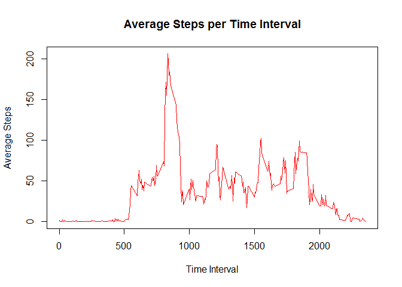

# Reproducible Research: Peer Assessment 1


## Loading and preprocessing the data

####Required Library for this section is Lubridate. Load it now.

```r
library(lubridate)
```

```
## 
## Attaching package: 'lubridate'
```

```
## The following object is masked from 'package:base':
## 
##     date
```

```r
library(lattice)
```

####Unzip data and load csv.  Format date column to date format. Once this is done  take a look at the first couple rows.


```r
if (!file.exists("./ativity.csv")) {
    unzip("./activity.zip")
}
act <- read.csv("activity.csv")
library(lubridate)
act$date <- ymd(act$date)
head(act)
```

```
##   steps       date interval
## 1    NA 2012-10-01        0
## 2    NA 2012-10-01        5
## 3    NA 2012-10-01       10
## 4    NA 2012-10-01       15
## 5    NA 2012-10-01       20
## 6    NA 2012-10-01       25
```

## What is mean total number of steps taken per day?
####To answer this quesiton we are going to take a look at a histogram of the total number of steps taken each day during the data recording time frame.


```r
data <- na.omit(act)
totalDay <- aggregate(data$steps, by = list(data$date), sum)
hist(totalDay$x, breaks = 10, xlab =  "Total number of steps taken for 1 day", main = "Histogram of Steps taken each day", col ="blue")
```

<!-- -->

####From this data we calculate the mean and median, respectively, for the total number of steps taken per day.


```r
mean(totalDay$x)
```

```
## [1] 10766.19
```

```r
median(totalDay$x)
```

```
## [1] 10765
```

## What is the average daily activity pattern?

####To answer this we will group the data using the aggregate function on the time interval and find the average for this interval.  To help visualize this we will plot the data.


```r
time <- aggregate(data$steps, by = list(data$interval), mean)
plot(time,type = "l",xlab = "Time Interval", ylab = "Average Steps", main ="Average Steps per Time Interval", col = "red")
```

<!-- -->


#### From this graph we can see that the most active time interval occurs on average in the 800s.  However we will use the following code to determine the exact interval


```r
time[time$x==max(time$x),1]
```

```
## [1] 835
```

## Imputing missing values

####We run into  a problem where there are quite a few NAs in the data.  The following code will uncover just how many there are.


```r
sum(is.na(act$steps))
```

```
## [1] 2304
```

####Quite a few!  In order to accomedate for this we will take the average of the time interval from the previous data frame called -time- to fill the time interval data that we are missing.  Once we have this data we will prepare a histogram of the average steps per day to compare to the data with the NAs (see above).


```r
newdata <-act
    n=1
    for (i in 1:length(act$interval)){
        if (is.na(newdata[n,1])){
            newdata[n,1] <- time[time$Group.1==newdata[n,3],2]
           
        }
         n <-n+1
    }
totalDayNewData <- aggregate(newdata$steps, by = list(newdata$date), sum)
hist(totalDayNewData$x, breaks = 10, xlab =  "Total number of steps taken for 1 day", main = "Histogram of Steps taken each day (Mod. NA data)", col ="red")    
```

<!-- -->

####We can find the new mean and median for this modified data witht the following code.


```r
mean(totalDayNewData$x)
```

```
## [1] 10766.19
```

```r
median(totalDayNewData$x)
```

```
## [1] 10766.19
```

####Here we can see that the modified data has a mean of 10766.19 and same as previous.  But the median has shifted up slightly to 10766.19 from 10765.  We can see that by filling in the missin data with averages from the data we haven't affected the mean but since we are increasing the number of data that we have we have shifted the median slightly.

## Are there differences in activity patterns between weekdays and weekends?

#### To answer this question we need to first classify the data recorded as either a weekday or a weekend.  We will use our new data set (newdata) with the NAs filled in.

####We will find and fill in all the weekends and then find and fill in all the not weekends.  Once we have completed this we will create a plot of the average steps per time interval to see if activity levels differ from weekends to weekdays.


```r
#add new column to newdata data frame
newdata[weekdays(newdata$date)=="Sunday"| weekdays(newdata$date)=="Saturday","day"] <- ("Weekend")
newdata[!weekdays(newdata$date)=="Sunday"& !weekdays(newdata$date)=="Saturday","day"] <- ("Weekday")

#find the average for the time interval by weekday/weekend
newintervaldata <- aggregate(newdata$steps, by =list(newdata$interval, newdata$day), mean)
names(newintervaldata) <-c("Interval","Day","Steps")

#plot data
xyplot(newintervaldata$Steps ~ newintervaldata$Interval | newintervaldata$Day,type ="l", ylab = "Average Steps per Interval", xlab = "Time Interval", layout=c(1,2))
```

<!-- -->

####We can see from this graph that weekdays have a higher peak in steps on average.  While the weekend average data seems to indicate a higher sustained activity level with more steps on average for more time intervals than observed in the weekday data.
